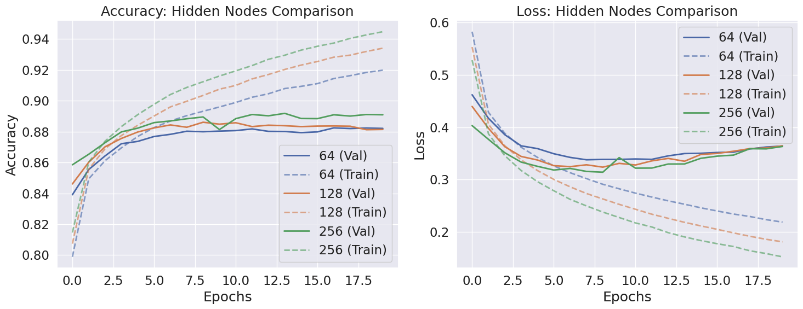
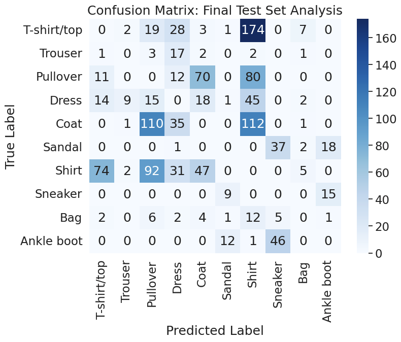

# Fashion MNIST FCNN Hyperparameter Tuning

## Problem Statement & Objective

This project investigates the training dynamics and generalization behavior through controlled hyperparameter experiments of a Fully Connected Neural Network (FCNN) on Fashion MNIST (60,000 training images, 10,000 test images, 10 classes) using a reproducible, containerized pipeline.

## Feature Processing & Model Design

| Component | Description |
|------------|-------------|
| **Normalization** | Scaled pixel values to `[0,1]` for stable gradient updates. |
| **Stratified Split** | 80/20 train-validation split preserving class balance. |
| **Flatten Layer** | Converted 28×28 images into 784-length vectors for FCNN input. |
| **One-Hot Encoding** | Encoded labels for multi-class softmax classification. |

---

## Results

**Test Accuracy: 87.79%**  
Validation closely matched test (~88%), confirming no data leakage.  
A persistent train–validation gap indicates moderate overfitting.

### Key Insights

- **Capacity:** Increasing hidden units (128 → 256) yielded marginal gains but doubled parameters, demonstrating diminishing returns.
- **Activation:** Sigmoid slowed convergence and acted as implicit regularization.
- **Loss:** CCE optimized softmax outputs effectively but amplified overfitting under higher capacity.



### Architectural Limitations:

Performance plateaued at ~88%, suggesting FCNN capacity limits. Convolutional architectures would better capture spatial hierarchies.



---

## Tech Stack
Python 3.11 · TensorFlow 2.15 · NumPy · Pandas · Scikit-Learn · Matplotlib · Docker

## Reproducibility

This project is fully containerized to ensure consistent dependency management and environment isolation.

```bash
git clone https://github.com/rayteo/fashion-mnist-fcnn-hyperparameter-tuning.git
cd fashion-mnist-fcnn-hyperparameter-tuning
docker build -t fashion-mnist-experiments .
docker run -it fashion-mnist-experiments